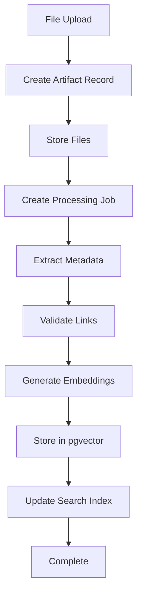

# Artifacts Workflow Documentation

## 1. Upload Artifacts Logic

The artifact upload system follows a multi-step process:

### Upload Flow:
1. **Initial Upload** (`/api/artifacts/bulk-upload/`)
   - Accepts files and metadata via multipart form data
   - Creates `Artifact` record with user-provided metadata
   - Stores uploaded files as `UploadedFile` objects
   - Creates `EvidenceLink` records for both files and URLs
   - Initiates async processing job via Celery

2. **Processing Pipeline**:
   - Status: `pending` → `processing` → `completed`/`failed`
   - Returns task ID for status tracking
   - Background processing extracts metadata and validates links

### Key Components:
- **Models**: `Artifact`, `EvidenceLink`, `UploadedFile`, `ArtifactProcessingJob`
- **Views**: `bulk_upload_artifacts()`, `artifact_processing_status()`
- **Tasks**: `process_artifact_upload()` (Celery async task)

## 2. Multi-Format Data Handling

The system supports diverse artifact types through a flexible architecture:

### Supported Formats:
```python
ARTIFACT_TYPES = [
    ('project', 'Project'),
    ('publication', 'Publication'),
    ('presentation', 'Presentation'),
    ('certification', 'Certification'),
    ('experience', 'Work Experience'),
    ('education', 'Education'),
]

LINK_TYPES = [
    ('github', 'GitHub Repository'),
    ('live_app', 'Live Application'),
    ('document', 'Document/PDF'),
    ('website', 'Website'),
    ('portfolio', 'Portfolio'),
    ('other', 'Other'),
]
```

### Processing Strategies:

1. **PDF Documents**:
   - Extract metadata (title, author, creation date, page count)
   - Extract first page text for preview
   - Store as searchable content

2. **GitHub Repositories**:
   - Fetch repository metadata via GitHub API
   - Extract languages, stars, forks, topics
   - Analyze recent commits
   - Track activity metrics

3. **Web Content**:
   - Validate URL accessibility
   - Extract final URL after redirects
   - Store HTTP headers and status

### Modern Enhancement Ideas:

Based on industry best practices (LangChain integration):

1. **Advanced Document Processing**:
   - Use LangChain's `PyPDFLoader` for robust PDF parsing
   - Implement `RecursiveCharacterTextSplitter` for optimal chunking
   - Support OCR for scanned documents using `pytesseract`

2. **Enhanced GitHub Analysis**:
   - Use `GithubRepoLoader` from LangChain for comprehensive code analysis
   - Extract README content and documentation
   - Analyze code complexity and project structure
   - Generate AI summaries of project purpose

3. **Web Scraping Improvements**:
   - Implement `WebBaseLoader` for better HTML parsing
   - Extract structured data (schemas, metadata)
   - Support JavaScript-rendered content with Playwright

4. **Multi-modal Support**:
   - Images: Extract EXIF data, generate descriptions
   - Videos: Extract transcripts, generate summaries
   - Audio: Transcription and key points extraction

## 3. Backend Processing Pipeline

The backend performs sophisticated processing on uploaded artifacts:

### Current Processing:

1. **Metadata Extraction** (`extract_pdf_metadata()`):
   - PDF metadata parsing (title, author, dates)
   - Text extraction from first page
   - Page count and document properties

2. **Link Validation** (`validate_evidence_link()`):
   - HTTP HEAD requests to verify accessibility
   - Capture redirect chains
   - Store validation timestamps
   - Track success/failure states

3. **GitHub Analysis** (`analyze_github_repository()`):
   - Repository statistics (stars, forks, issues)
   - Language distribution
   - Recent commit history
   - Topics and tags extraction

### Enhanced Processing with LLM Integration:

The system includes advanced LLM services for intelligent processing:

1. **Embedding Generation**:
   ```python
   # FlexibleEmbeddingService generates vector embeddings
   - Text chunking with configurable strategies
   - Multi-model support (OpenAI, Anthropic)
   - Batch processing for efficiency
   - Cost tracking per operation
   ```

2. **Vector Storage (pgvector)**:
   ```python
   # EnhancedArtifact model with embeddings
   - content_embedding: 1536-dimensional vectors
   - summary_embedding: For quick similarity search
   - Chunk-level embeddings for granular search
   ```

3. **Intelligent Model Selection**:
   - Dynamic model choice based on task complexity
   - Fallback mechanisms for reliability
   - Performance tracking and optimization
   - Cost-aware processing

4. **Semantic Search Capabilities**:
   - Find similar artifacts using cosine similarity
   - Match artifacts to job descriptions
   - Rank achievements by relevance
   - Context-aware content retrieval

### Processing Workflow:



### Advanced Features:

1. **Circuit Breaker Pattern**:
   - Tracks API failures
   - Automatic fallback to alternative models
   - Self-healing with exponential backoff

2. **Cost Optimization**:
   - Model performance metrics tracking
   - Daily cost aggregation per user
   - Intelligent model selection based on budget

3. **Async Processing**:
   - Celery task queue for background jobs
   - Progress tracking with percentage updates
   - Error recovery and retry logic

4. **Caching Strategy**:
   - Job description embeddings cached
   - Reuse embeddings for similar content
   - 24-hour auto-cleanup for temporary files

## Modern Best Practices Recommendations:

1. **LangChain Integration**:
   - Implement document loaders for all file types
   - Use text splitters for optimal chunking
   - Add chain-of-thought reasoning for content analysis

2. **Enhanced Vector Search**:
   - Implement hybrid search (keyword + semantic)
   - Add metadata filtering for precise retrieval
   - Use re-ranking models for better results

3. **Multi-stage Processing**:
   - Stage 1: Quick extraction for immediate feedback
   - Stage 2: Deep analysis with LLM enhancement
   - Stage 3: Cross-reference and validation

4. **Quality Assurance**:
   - Automated content validation
   - Duplicate detection using embeddings
   - Relevance scoring for uploaded content

5. **Scalability Improvements**:
   - Implement streaming for large files
   - Add distributed processing for bulk uploads
   - Use connection pooling for external APIs

This architecture enables the system to handle diverse artifact types efficiently while providing rich metadata extraction, intelligent processing, and semantic search capabilities for optimal CV/resume generation.