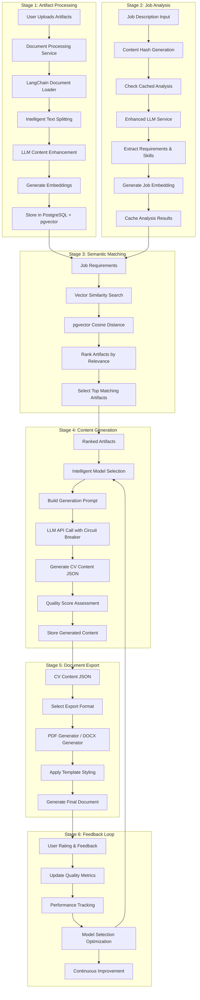

# CV Generation Pipeline - Technical Overview

## Pipeline Architecture Diagram

## High-Level Process Flow

### 1. Artifact Processing Pipeline

**Purpose**: Transform raw user documents into searchable, structured content with semantic embeddings.

**Main Functions**:
- `enhance_artifact_with_llm()` - Async Celery task for complete artifact processing
- `AdvancedDocumentProcessor.process_document()` - Multi-format document processing with LangChain
- `FlexibleEmbeddingService.store_artifact_embeddings()` - Generate and store vector embeddings

**Process Flow**:
1. **Document Ingestion**: Accept various formats (PDF, GitHub repos, web profiles, text)
2. **LangChain Processing**: Intelligent document loading and structure-aware text splitting
3. **Content Enhancement**: LLM-powered metadata extraction and skill identification
4. **Embedding Generation**: Convert content to high-dimensional vectors for similarity search
5. **Storage**: Store in PostgreSQL with pgvector extension for efficient vector operations

**Technologies Used**:
- **LangChain**: Document loading, text splitting, multi-format processing
- **pgvector**: High-performance vector similarity search in PostgreSQL
- **Celery**: Async background processing with Redis broker
- **LiteLLM**: Unified API access to multiple LLM providers

### 2. Job Description Analysis

**Purpose**: Parse and understand job requirements to enable intelligent artifact matching.

**Main Functions**:
- `EnhancedLLMService.parse_job_description()` - Extract structured requirements
- `FlexibleEmbeddingService.generate_and_cache_job_embedding()` - Create job embeddings with caching
- `JobDescription.get_or_create_from_content()` - Content-based deduplication

**Process Flow**:
1. **Content Hashing**: Generate SHA256 hash for efficient caching and deduplication
2. **LLM Parsing**: Extract skills, responsibilities, seniority level, and company info
3. **Embedding Generation**: Create vector representation for semantic matching
4. **Caching**: Store analysis results to optimize repeated requests
5. **Confidence Scoring**: Assess parsing quality for reliability metrics

### 3. Semantic Matching Engine

**Purpose**: Use vector similarity to identify the most relevant artifacts for each job application.

**Main Functions**:
- `FlexibleEmbeddingService.find_similar_artifacts()` - Vector similarity search
- `EnhancedLLMService.rank_artifacts_by_relevance()` - Multi-modal ranking with fallbacks
- `FlexibleEmbeddingService.rank_artifacts_by_job_relevance()` - Job-specific artifact ranking

**Process Flow**:
1. **Vector Search**: Use pgvector cosine distance for initial similarity ranking
2. **Hybrid Ranking**: Combine semantic similarity with keyword matching
3. **Relevance Scoring**: Generate 0-10 relevance scores with explanations
4. **Top-K Selection**: Select most relevant artifacts based on configurable thresholds
5. **Fallback Handling**: Keyword-based ranking when embeddings unavailable

### 4. Content Generation System

**Purpose**: Generate professional CV content using intelligent LLM selection and robust error handling.

**Main Functions**:
- `generate_cv_task()` - Main Celery task orchestrating CV generation
- `EnhancedLLMService.generate_cv_content()` - Core content generation with model selection
- `IntelligentModelSelector.select_model_for_task()` - Dynamic model routing based on complexity

**Process Flow**:
1. **Model Selection**: Choose optimal LLM based on task complexity, cost, and performance history
2. **Prompt Engineering**: Build context-aware prompts with job requirements and artifact data
3. **Circuit Breaker**: Protect against model failures with automatic fallback routing
4. **Content Generation**: Generate structured JSON content with professional summary, skills, experience
5. **Quality Assessment**: Score content quality and alignment with job requirements
6. **Performance Tracking**: Monitor latency, cost, and success rates for continuous optimization

**Key Features**:
- **Multi-Provider Support**: OpenAI, Anthropic, and other LLM providers via LiteLLM
- **Intelligent Routing**: Select models based on complexity, cost constraints, and historical performance
- **Fallback Mechanisms**: Automatic retry with alternative models on failure
- **Cost Optimization**: Track and optimize API costs across different providers

### 5. Document Export System

**Purpose**: Generate professional PDF and DOCX documents with customizable templates and formatting.

**Main Functions**:
- `PDFGenerator.generate_cv()` - Create styled PDF documents with ReportLab
- `DOCXGenerator.generate_cv()` - Generate Word documents with python-docx
- Export view handlers for format selection and customization options

**Process Flow**:
1. **Format Selection**: Choose between PDF, DOCX based on user preference
2. **Template Application**: Apply professional styling and layout templates
3. **Content Rendering**: Convert JSON content to formatted document sections
4. **Evidence Integration**: Optional inclusion of supporting links and QR codes
5. **Final Generation**: Produce downloadable documents with proper metadata

**Customization Options**:
- **Section Control**: Include/exclude specific CV sections (experience, projects, education)
- **Evidence Formats**: Hyperlinks, QR codes, or footnote references
- **Template Styles**: Modern, classic, technical, or creative layouts
- **Export Metadata**: Proper document properties and accessibility features

### 6. Feedback and Optimization Loop

**Purpose**: Continuously improve generation quality through user feedback and performance analytics.

**Main Functions**:
- `rate_generation()` - Collect user ratings and feedback
- `ModelPerformanceTracker.record_task()` - Track model performance metrics
- `generation_analytics()` - Provide user-specific analytics and insights

**Process Flow**:
1. **Feedback Collection**: Gather user ratings, comments, and usage patterns
2. **Performance Monitoring**: Track success rates, latency, and cost per model
3. **Quality Metrics**: Calculate skill match scores and content alignment
4. **Model Optimization**: Adjust model selection based on performance data
5. **User Analytics**: Provide insights on generation history and improvement suggestions

## Core Technology Stack

### Backend Infrastructure
- **PostgreSQL 15+**: Primary database with full-text search capabilities
- **pgvector**: High-performance vector similarity search extension
- **Redis**: Caching and Celery message broker
- **Celery**: Distributed task queue for async processing

### LLM and AI Services
- **LiteLLM**: Unified interface for multiple LLM providers (OpenAI, Anthropic, etc.)
- **LangChain**: Document processing, text splitting, and content loaders
- **OpenAI Embeddings**: High-quality text embeddings for semantic search
- **Custom Model Registry**: Intelligent model selection and performance tracking

### Document Processing
- **ReportLab**: Professional PDF generation with custom styling
- **python-docx**: Microsoft Word document creation
- **PyPDF**: PDF text extraction and processing
- **Unstructured**: Advanced document parsing for various formats

## Performance and Reliability Features

### Intelligent Model Selection
- **Complexity Assessment**: Analyze task requirements to select optimal models
- **Cost Optimization**: Balance quality and cost across different LLM providers
- **Performance History**: Learn from past performance to improve future selections

### Error Handling and Resilience
- **Circuit Breakers**: Protect against model failures with automatic fallback
- **Retry Logic**: Exponential backoff with alternative model routing
- **Graceful Degradation**: Fallback to simpler methods when advanced features fail

### Caching and Optimization
- **Content-Based Caching**: SHA256 hashing for efficient job description caching
- **Embedding Reuse**: Cache expensive embedding operations
- **Database Optimization**: Efficient vector indexing with pgvector

### Quality Assurance
- **Confidence Scoring**: Assess reliability of LLM outputs
- **Content Validation**: Ensure generated content is grounded in user artifacts
- **Skill Alignment**: Measure how well CV matches job requirements

## Configuration and Customization

### Environment Variables
- `MODEL_SELECTION_STRATEGY`: balanced, cost_optimized, quality_focused
- `OPENAI_API_KEY`, `ANTHROPIC_API_KEY`: LLM provider credentials
- `LANGCHAIN_SETTINGS`: Document processing configuration
- `EMBEDDING_DIMENSIONS`: Vector embedding size (default: 1536)

### Extensibility Points
- **Custom Templates**: Add new CV templates and styling options
- **LLM Providers**: Integrate additional language model providers
- **Document Formats**: Support new input/output document types
- **Embedding Models**: Use different embedding models for various use cases

This pipeline provides a comprehensive, production-ready system for automated CV generation that combines the latest in AI technology with robust engineering practices for reliability, performance, and user experience.