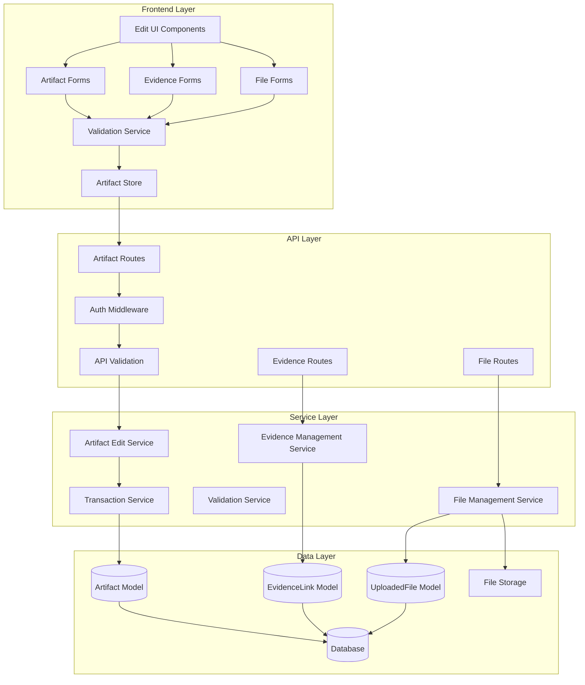

# Technical Specification: Artifact Editing System

**Document ID:** SPEC-20250924-02-SYSTEM
**Date:** 2024-09-24
**Status:** Draft
**Author:** Claude Code
**Related PRD:** PRD-20250924-02

## Overview

This technical specification defines the implementation approach for the artifact editing functionality, enabling users to modify artifact metadata, manage evidence links, and handle file operations with comprehensive validation and security measures.

## Architecture Diagram



## Component Inventory

| Component | Type | Technology | Purpose |
|-----------|------|------------|---------|
| **Frontend Components** | | | |
| ArtifactEditForm | React Component | TypeScript, React Hook Form | Main artifact editing interface |
| EvidenceLinkManager | React Component | TypeScript, React | Evidence link CRUD operations |
| FileUploadManager | React Component | TypeScript, React | File upload/replacement operations |
| BulkEditDialog | React Component | TypeScript, React | Multi-artifact editing interface |
| ValidationDisplay | React Component | TypeScript, React | Real-time validation feedback |
| **Backend Services** | | | |
| ArtifactUpdateService | Django Service | Python, Django | Artifact modification logic |
| EvidenceManagerService | Django Service | Python, Django | Evidence link management |
| FileManagerService | Django Service | Python, Django | File operations and cleanup |
| ValidationService | Django Service | Python, Django | Data validation and integrity |
| **API Endpoints** | | | |
| PATCH /artifacts/{id} | REST Endpoint | Django REST Framework | Partial artifact updates |
| PUT /artifacts/{id} | REST Endpoint | Django REST Framework | Full artifact replacement |
| POST /artifacts/{id}/evidence | REST Endpoint | Django REST Framework | Add evidence links |
| PUT /evidence/{id} | REST Endpoint | Django REST Framework | Update evidence links |
| DELETE /evidence/{id} | REST Endpoint | Django REST Framework | Remove evidence links |
| POST /artifacts/{id}/files | REST Endpoint | Django REST Framework | Add files to artifact |
| DELETE /files/{id} | REST Endpoint | Django REST Framework | Remove files |
| **Data Models** | | | |
| Artifact | Django Model | PostgreSQL/SQLite | Main artifact data |
| EvidenceLink | Django Model | PostgreSQL/SQLite | Supporting evidence |
| UploadedFile | Django Model | PostgreSQL/SQLite | File metadata |
| ArtifactHistory | Django Model | PostgreSQL/SQLite | Change tracking (future) |

## API Specifications

### Artifact Update Endpoints

#### PATCH /api/v1/artifacts/{artifact_id}/
**Purpose:** Partial artifact updates
**Method:** PATCH
**Authentication:** Required
**Content-Type:** application/json

**Request Body:**
```json
{
  "title": "Updated Project Title",
  "description": "Updated description",
  "artifact_type": "project",
  "start_date": "2023-01-01",
  "end_date": "2024-01-01",
  "technologies": ["React", "TypeScript", "Node.js"],
  "collaborators": ["john@example.com", "jane@example.com"]
}
```

**Response (200 OK):**
```json
{
  "id": 123,
  "title": "Updated Project Title",
  "description": "Updated description",
  "artifact_type": "project",
  "start_date": "2023-01-01",
  "end_date": "2024-01-01",
  "technologies": ["React", "TypeScript", "Node.js"],
  "collaborators": ["john@example.com", "jane@example.com"],
  "evidence_links": [...],
  "created_at": "2024-01-01T00:00:00Z",
  "updated_at": "2024-09-24T10:30:00Z"
}
```

**Error Responses:**
- `400 Bad Request` - Validation errors
- `404 Not Found` - Artifact doesn't exist or not owned by user
- `403 Forbidden` - Permission denied

#### PUT /api/v1/artifacts/{artifact_id}/
**Purpose:** Full artifact replacement
**Method:** PUT
**Authentication:** Required
**Content-Type:** application/json

**Request Body:** Same as PATCH but all fields required

### Evidence Link Management

#### POST /api/v1/artifacts/{artifact_id}/evidence-links/
**Purpose:** Add new evidence link
**Method:** POST
**Authentication:** Required

**Request Body:**
```json
{
  "url": "https://github.com/user/project",
  "link_type": "github",
  "description": "Project source code"
}
```

**Response (201 Created):**
```json
{
  "id": 456,
  "url": "https://github.com/user/project",
  "link_type": "github",
  "description": "Project source code",
  "validation_metadata": {},
  "is_accessible": true,
  "created_at": "2024-09-24T10:30:00Z"
}
```

#### PUT /api/v1/evidence-links/{link_id}/
**Purpose:** Update existing evidence link
**Method:** PUT
**Authentication:** Required

#### DELETE /api/v1/evidence-links/{link_id}/
**Purpose:** Remove evidence link
**Method:** DELETE
**Authentication:** Required
**Response:** 204 No Content

### File Management

#### POST /api/v1/artifacts/{artifact_id}/files/
**Purpose:** Add files to artifact
**Method:** POST
**Content-Type:** multipart/form-data
**Authentication:** Required

**Request Body:**
```
files: [File1, File2, ...]
descriptions: ["Description 1", "Description 2", ...]
```

#### DELETE /api/v1/files/{file_id}/
**Purpose:** Remove file from artifact
**Method:** DELETE
**Authentication:** Required
**Response:** 204 No Content

### Bulk Operations

#### PATCH /api/v1/artifacts/bulk/
**Purpose:** Bulk update multiple artifacts
**Method:** PATCH
**Authentication:** Required

**Request Body:**
```json
{
  "artifact_ids": [123, 124, 125],
  "updates": {
    "technologies": {
      "action": "add",
      "values": ["Docker", "Kubernetes"]
    },
    "artifact_type": "project"
  }
}
```

## Data Validation Rules

### Artifact Validation

| Field | Rules |
|-------|--------|
| title | Required, max 255 characters, non-empty |
| description | Required, max 5000 characters |
| artifact_type | Must be one of valid choices |
| start_date | Valid date format, can be null |
| end_date | Valid date format, must be after start_date if both provided |
| technologies | Array of strings, max 50 items, each max 50 chars |
| collaborators | Array of valid email addresses, max 20 items |

### Evidence Link Validation

| Field | Rules |
|-------|--------|
| url | Valid URL format, max 2048 characters |
| link_type | Must be one of valid choices |
| description | Max 255 characters |
| file_path | Internal use only, validated on server |

### File Validation

| Rule | Specification |
|------|---------------|
| File Size | Max 10MB per file |
| File Types | PDF, DOC, DOCX, TXT, MD |
| Total Files | Max 20 files per artifact |
| File Name | Max 255 characters, sanitized |

## Security Considerations

### Authorization
- Users can only edit their own artifacts
- JWT token validation required for all endpoints
- Permission checks at model level
- Rate limiting: 100 requests per hour per user

### Input Validation
- Server-side validation for all user inputs
- SQL injection prevention through ORM
- XSS protection through input sanitization
- File type validation using magic numbers

### File Security
- File uploads to isolated directory
- Virus scanning for uploaded files (future)
- File size and type restrictions enforced
- Automatic cleanup of orphaned files

### Data Integrity
- Atomic transactions for multi-model updates
- Foreign key constraint validation
- Concurrent edit detection using updated_at timestamps
- Database-level constraints for critical fields

## Database Schema Updates

### New Fields (if needed)
```sql
-- Add version tracking field to Artifact model
ALTER TABLE artifacts_artifact ADD COLUMN version INTEGER DEFAULT 1;

-- Add edit history tracking (future enhancement)
CREATE TABLE artifacts_artifact_history (
    id SERIAL PRIMARY KEY,
    artifact_id INTEGER REFERENCES artifacts_artifact(id),
    user_id INTEGER REFERENCES auth_user(id),
    field_name VARCHAR(50),
    old_value TEXT,
    new_value TEXT,
    changed_at TIMESTAMP DEFAULT NOW()
);
```

### Indexes for Performance
```sql
-- Index for user-specific artifact queries
CREATE INDEX idx_artifact_user_updated ON artifacts_artifact(user_id, updated_at DESC);

-- Index for evidence link artifact queries
CREATE INDEX idx_evidence_artifact ON artifacts_evidencelink(artifact_id);

-- Index for file artifact queries
CREATE INDEX idx_file_artifact ON artifacts_uploadedfile(artifact_id) WHERE artifact_id IS NOT NULL;
```

## Frontend State Management

### Zustand Store Structure
```typescript
interface ArtifactEditStore {
  // Current editing state
  editingArtifact: Artifact | null;
  isDirty: boolean;
  validationErrors: ValidationErrors;

  // Actions
  setEditingArtifact: (artifact: Artifact) => void;
  updateArtifactField: (field: string, value: any) => void;
  addEvidenceLink: (link: EvidenceLink) => void;
  updateEvidenceLink: (id: string, updates: Partial<EvidenceLink>) => void;
  removeEvidenceLink: (id: string) => void;

  // File operations
  addFiles: (files: File[]) => void;
  removeFile: (fileId: string) => void;

  // Persistence
  saveChanges: () => Promise<void>;
  discardChanges: () => void;

  // Validation
  validateField: (field: string, value: any) => ValidationResult;
  validateAll: () => ValidationResult;
}
```

### Form State Management
```typescript
interface ArtifactFormState {
  values: Partial<Artifact>;
  errors: FormErrors;
  touched: TouchedFields;
  isSubmitting: boolean;
  isDirty: boolean;
}
```

## Error Handling

### Client-Side Error Handling
```typescript
class ArtifactEditError extends Error {
  constructor(
    message: string,
    public field?: string,
    public recoverable: boolean = true
  ) {
    super(message);
  }
}

const handleEditError = (error: ArtifactEditError) => {
  if (error.recoverable) {
    showNotification(error.message, 'warning');
    if (error.field) {
      focusField(error.field);
    }
  } else {
    showDialog('Edit Failed', error.message);
    rollbackChanges();
  }
};
```

### Server-Side Error Responses
```python
class ArtifactEditException(Exception):
    def __init__(self, message, field=None, code='edit_error'):
        self.message = message
        self.field = field
        self.code = code
        super().__init__(message)

def handle_edit_error(exception):
    return Response({
        'error': exception.code,
        'message': exception.message,
        'field': exception.field,
        'recoverable': True
    }, status=400)
```

## Performance Optimization

### Database Optimizations
- Use select_related() for artifact with evidence_links
- Implement pagination for large artifact lists
- Cache commonly accessed data (technology suggestions)
- Use database indexes on frequently queried fields

### Frontend Optimizations
- Debounced validation (500ms delay)
- Optimistic updates with rollback capability
- Lazy loading of evidence link validation
- Virtual scrolling for large file lists

### Caching Strategy
- Browser cache for static assets
- Redis cache for expensive operations
- Session storage for temporary form data
- Service worker for offline capability (future)

## Testing Strategy

### Unit Tests
- **Backend**: Django TestCase for models, serializers, views
- **Frontend**: Vitest for services, React Testing Library for components
- **Coverage Target**: 90% for critical paths

### Integration Tests
- API endpoint testing with authenticated requests
- Database transaction testing
- File upload/download workflows
- Error handling scenarios

### End-to-End Tests
- Complete edit workflows using Playwright
- Multi-user editing scenarios
- File operations testing
- Cross-browser compatibility

## Monitoring and Observability

### Metrics to Track
- Edit operation success/failure rates
- Average edit completion time
- File upload success rates
- Validation error frequency
- User engagement with edit features

### Logging Strategy
```python
logger.info(
    f'Artifact updated: {artifact.id}',
    extra={
        'user_id': user.id,
        'artifact_id': artifact.id,
        'fields_changed': list(changes.keys()),
        'action': 'artifact_updated'
    }
)
```

### Error Tracking
- Sentry integration for exception tracking
- Custom error categorization
- User context preservation
- Performance monitoring

## Migration Plan

### Phase 1: Core Editing (Week 1)
- Basic artifact metadata editing
- Simple validation
- Database migrations

### Phase 2: Evidence Management (Week 2)
- Evidence link CRUD operations
- URL validation
- File association updates

### Phase 3: File Operations (Week 3)
- File upload/replacement
- File cleanup processes
- Advanced validation

### Phase 4: Bulk Operations (Week 4)
- Multi-artifact editing
- Batch operations
- Performance optimization

## Rollback Plan

### Database Rollback
```bash
# Rollback migrations if issues occur
python manage.py migrate artifacts 0003_previous_version
```

### Feature Flags
```python
# Use feature flags for gradual rollout
if settings.FEATURE_ARTIFACT_EDITING:
    # New editing functionality
else:
    # Fallback to read-only view
```

### Monitoring Alerts
- High error rates trigger automatic feature disable
- Performance degradation alerts
- Database query monitoring

## Success Metrics

### Technical Metrics
- **API Response Time**: < 200ms for metadata updates
- **File Upload Time**: < 30 seconds for 10MB files
- **Error Rate**: < 1% for edit operations
- **Database Query Count**: < 5 queries per edit operation

### User Experience Metrics
- **Edit Success Rate**: > 95%
- **Validation Error Rate**: < 10%
- **User Abandonment**: < 5% mid-edit
- **Time to Complete Edit**: < 2 minutes average

### Business Metrics
- **Feature Adoption**: 70% of users use editing within 30 days
- **Edit Frequency**: Average 2.5 edits per artifact
- **Data Quality**: 25% reduction in duplicate artifacts
- **User Satisfaction**: 90%+ satisfaction score